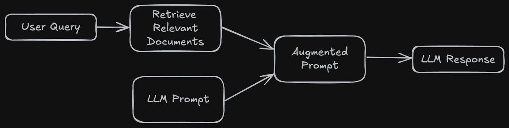
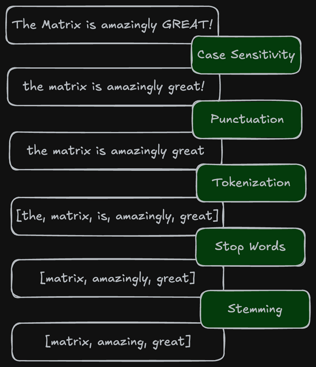

# learn-retrieval-augmented-generation

This document explains how a Retrieval Augmented Generation (RAG) works.


Course from https://www.boot.dev/


# Prerequisites

1. Install the Python package and project manager [UV](https://docs.astral.sh/uv/getting-started/installation/).

2. Download the data by running the following command:
```bash
scripts/download-data.sh
```
> NOTE: Some characters of the movies.json file are not decoded correctly, but that's okay; it doesn't prevent you from understanding the main points.

# Commands
Run CLI:
```bash
uv run .\cli\keyword_search_cli.py search "furious fast"
```

Run linter:
```bash
uv run ruff check
```

Run formatter:
```bash
uv run ruff format
```

# How RAG works

## Intro
RAG: Retrieval Augmented Generation.

- **R**etrieve information via a search algorithm
- **A**ugment our instructions with the search results
- **G**enerate better, richer, and more accurate information using LLMs

Search is a non-negotiable feature of nearly all content-based web applications. By using a RAG, we're able to retrieve a much more accurate result from a given query.




## Pre-processing / Tokenization

User input (eg. search query) and data text (eg. movie title, description, etc.) has to be tokenized before usage.

1. **Case sensitivity:** Convert all text to lowercase
2. **Punctuations:** Remove all [punctuations](https://en.wikipedia.org/wiki/Punctuation)
3. **Tokenization:** Break text into individual words
4. **Stop Words:** Remove all [stop words](https://en.wikipedia.org/wiki/Stop_word) (a, an, the, etc.)
5. **Stemming:** [Stem](https://en.wikipedia.org/wiki/Stemming) each token




## Term Frequency-Inverse Document Frequency (TF-IDF)

[Term frequency](https://en.wikipedia.org/wiki/Tf%E2%80%93idf#:~:text=%F0%9D%91%91-,Term%20frequency,-%5Bedit%5D) and [Inverse Document Frequency](https://en.wikipedia.org/wiki/Tf%E2%80%93idf) are often used together to create their ultimate form: [TF-IDF (Term Frequency-Inverse Document Frequency)](https://en.wikipedia.org/wiki/Tf%E2%80%93idf#:~:text=.-,Term%20frequency%E2%80%93inverse%20document%20frequency,-%5Bedit%5D), it combines both metrics TF and IDF.

### Indexes
A Forward Index (also known as document index) maps each document to a list of terms (words or tokens) it contains. `Example: DocId1 -> ["apple", "banana", "fruit", etc.]`

An [inverted index](https://en.wikipedia.org/wiki/Inverted_index) maps each term (word or token) to the list of documents where that term appears. `Example: "apple" -> [doc1, doc2, etc.]`. This is what makes search fast for text search. We get `O(1)` complexity lookups on each token.

These indexes are used with the following algorithms to compute scores.

### Term Frequency (TF)

[Term frequency](https://en.wikipedia.org/wiki/Tf%E2%80%93idf#:~:text=%F0%9D%91%91-,Term%20frequency,-%5Bedit%5D) measures how often a word appears in a document.

**Example:**
```
The cat stretched lazily in the morning sun. After her nap, the cat wandered to the kitchen, hoping for breakfast. She meowed softly until her owner appeared with food. The cat purred contentedly as she ate.
```
Term frequencies:
- `cat` appears 3 times
- `breakfast` appears 1 time
- etc.

This is a signal that `cat` is likely more important than `breakfast`.

### Inverse Document Frequency (IDF)

[Inverse Document Frequency](https://en.wikipedia.org/wiki/Tf%E2%80%93idf) measures how rare a word appears across all documents.

Consider our dataset about astronaut movies:

```
"A movie about an actor who becomes an astronaut"
```

`actor` may be a great keyword to narrow the search in some datasets but many movies talk about actors.

**Document Frequency (DF)** measures how many documents in the dataset contain a term. The more documents a term appears in, the bigger its value.

So **Inverse Document Frequency (IDF)** measure how rare a term. The higher the score is, the rarest it is.

**Example:**

For `100` documents given in total:

- Common term (appears in 95 documents):
`astronaut: IDF = log(100/95) = 0.02 ← Low score`
- Rare term (appears in 2 docs):
`cyborg: IDF = log(100/2) = 1.7 ← High score`
- Universal term (appears in all docs):
`movie: IDF = log(100/100) = 0 ← Zero score`

**Formula:**
```python
math.log((total_doc_count + 1) / (term_match_doc_count + 1))
# +1 prevents division by zero
```

### So how works TF-IDF ?

**Formula:**
```
TF-IDF = TF * IDF
```
- **Frequent** words get high TF scores
- **Rare** words get high IDF scores
- **Best matches** have both high TF *and* high IDF


**Example:**

Suppose we search a dataset of 3 movies for "cyborg bear".

**Document 1:** "The Terminator – A cyborg from the future"

```
"cyborg": TF=1, IDF=3.9 → TF-IDF = 1 × 3.9 = 3.9
"bear":   TF=0, IDF=0.05 → TF-IDF = 0 × 0.05 = 0

Total score: 3.9
```

**Document 2:** "Ted – A talking bear who loves honey and bear friends"

```
"cyborg": TF=0, IDF=3.9 → TF-IDF = 0 × 3.9 = 0
"bear":   TF=2, IDF=0.05 → TF-IDF = 2 × 0.05 = 0.1

Total score: 0.1
```

**Document 3:** "Cyborg Bear – A robotic bear saves the city"
```
"cyborg": TF=1, IDF=3.9 → TF-IDF = 1 × 3.9 = 3.9
"bear":   TF=2, IDF=0.05 → TF-IDF = 2 × 0.05 = 0.1

Total score: 4.0
```

**Final Rankings:**

- Document 3 (Cyborg Bear) – 4.0 – Has both terms!
- Document 1 (Terminator) – 3.9 – Has rare "cyborg" term
- Document 2 (Ted) – 0.1 – Only common "bear" term


## Keyword search with Okapi BM25

> In information retrieval, Okapi BM25 (BM is an abbreviation of best matching) is a ranking function used by search engines to estimate the relevance of documents to a given search query.

[Okapi BM25](https://en.wikipedia.org/wiki/Okapi_BM25) (also known as BM25) addresses three key problems with basic TF-IDF:

- **Better IDF calculation:** More stable scoring for rare/common terms
- **Term frequency saturation:** Prevents terms from dominating by appearing too often
- **Document length normalization:** Accounts for longer vs shorter documents

### BM25 IDF

#### The IDF Problem

In basic TF-IDF, IDF is calculated as `log(N / df)`:
- **N =** total number of documents in the collection
- **df =** document frequency (how many documents contain this term)
- **log =** logarithm function (reduces the impact of very large numbers)

The problems with this formula are:

- **Division by zero:** When `df = 0` (we can "solved" this by adding 1 to both the numerator and denominator, but it's not enough)
- **Unstable rare terms:** Very rare terms get extremely high scores
- **Negative scores:** Very common terms can get negative scores

#### BM25 IDF Solution

BM25 uses a more stable IDF formula:
```
IDF = log((N - df + 0.5) / (df + 0.5) + 1)
```

This compares the documents that **don't contain** the term against documents that do contain it:

Components breakdown:
- Numerator (N - df + 0.5): Count of documents WITHOUT the term (plus smoothing)
- Denominator (df + 0.5): Count of documents WITH the term (plus smoothing)

Smoothing:
- Use [Laplace smoothing](https://en.wikipedia.org/wiki/Additive_smoothing) (also known as Additive smoothing) by adding `0.5` prevent division by `0`
- The final `+ 1` ensures IDF is always positive, which, again, just handles some edge cases


### Term Frequency Saturation

The BM25 prevents any single term from dominating search results just because it appears many times.

#### The Term Frequency Problem

In basic TF-IDF, if a word appears `100` times, it gets **10x** more weight than a word that appears `10` times. This creates problems:

Suppose the following query "*bear hunting*":
- Document A: "bear bear bear bear" → 4 matches
- Document B: "bear hunting guide for beginners" → 2 matches

With basic TF, Document A gets a much higher score despite being clearly less useful.

#### The Saturation Solution

BM25 uses diminishing returns – after a certain point, additional occurrences matter less.

Formula:
```
bm25_tf = (tf * (k1 + 1)) / (tf + k1)
```

`k1` is a tunable parameter that controls the diminishing returns (a common value is `1.5` but a value between `1.2 to 2` can be chosen). Let's see how different TF values get "saturated":

| Term Frequency | Basic TF | BM25 TF (k1=1.5) |
| -------------- | -------- | ---------------- |
| 1              | 1	    | 1.0              |
| 2              | 2	    | 1.4              |
| 5              | 5	    | 1.9              |
| 10             | 10	    | 2.2              |
| 20             | 20	    | 2.3              |

> BM25 TF grows much slower – the first few occurrences matter the most.


### Document Length Normalization

Ensuring longer documents don't get unfair advantages over shorter. Longer documents contain more words, which can artificially boost their scores.

**Example:**

*Query: "bear"*
- **Document A:** "Winny is a fat bear"
- **Document B:** "Ted is a wonderful, amazing, fantastic human who has a stuffed bear that loves honey, salmon, picnics, and hanging out with other bears in the woods. Ted's bear is so nice to hang out with Ted all day long."

Document B has higher term frequencies because it's longer, but not because it's more relevant.

#### The Length Normalization Solution

BM25 adjusts term frequency based on document length:

```python
# Length normalization factor
length_norm = 1 - b + b * (doc_length / avg_doc_length)

# Apply to term frequency
tf_component = (tf * (k1 + 1)) / (tf + k1 * length_norm)
```

#### The Core Ration `doc_length / avg_doc_length`

This ratio tells us how this document's length compares to the average document length in the dataset:

| Ratio |       Meaning        |   Effect  |
|-------|----------------------|-----------|
| = 1.0 | Average length       | No change |
| > 1.0 | Longer than average  | Penalized |
| < 1.0 | Shorter than average | Boosted   |

#### b (Normalization Strength)

`b` is a tunable parameter that controls how much we care about document length.
- If `b=0` then length norm is always 1
- If `b=1` then full normalization is applied

The key insight is:
- **Long documents** get higher `length_norm` and are **penalized** (lower scores)
- **Short documents** get lower `length_norm` and are **boosted** (higher scores)

> [!TIP]
> A common value is `0.75`, which tends to work well in most scenarios.